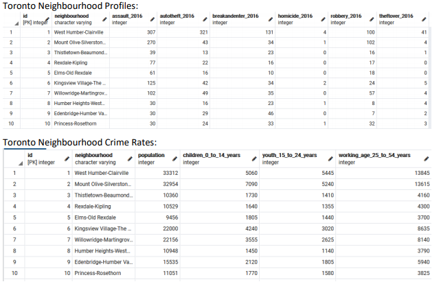

# Toronto Neighbourhood Population Census vs Crime Data

## Extraction

#### Data Sources:
- Toronto Neighbourhood 2016 Census of Population: https://ckan0.cf.opendata.inter.prod-toronto.ca/en_AU/dataset/neighbourhood-profiles
  Data Format: CSV file

- Toronto Neighbourhood 2016 Crime Data: https://data.torontopolice.on.ca/datasets/neighbourhood-crime-rates-boundary-file-/geoservice?geometry=-80.421%2C43.542%2C-78.335%2C43.890&orderBy=Hood_ID
  Data Format: GeoJSON file

## Transformation

From 2016 Census of population, Hood ID and Age population spectrum were extracted and a dataframe was created.

Toronto 2016 crime data was extracted from the GeoJSON api source and required keys were selected to create a dataframe. 

Data was parsed/cleaned. A connection to the SQL postgres was made.

## Loading to Database
SQL schema was created with the required keys for both the table in pgAdmin.
The databases were loaded through jupyter’s notebook and then connected and transferred to pgAdmin for easier merging and browsing.

By merging the two tables together, we are hoping to discover; 1), which neighbourhood is more
prominent in crime and 2) if there is a relation between crime rate and the age demographic.

